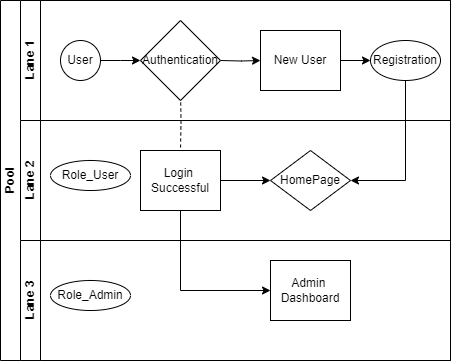
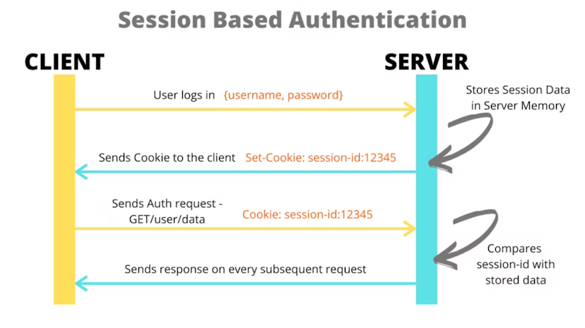
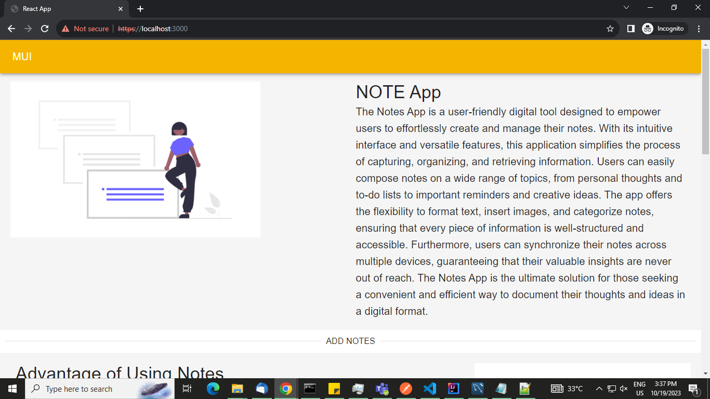
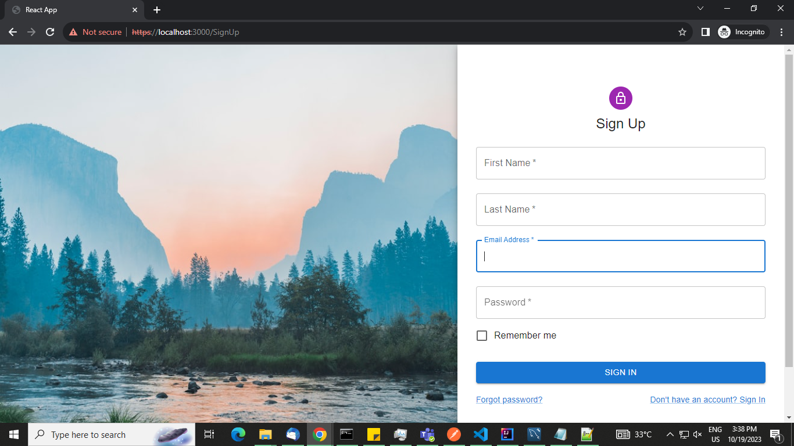
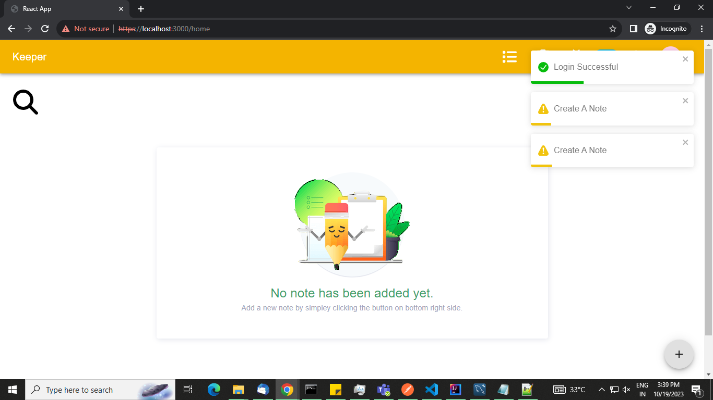

# Google Keep Clone

1. **User Authentication**:
   - Implement user registration and login functionality to allow users to create and access their notes securely.

2. **Note Creation and Editing**:
   - Provide a user-friendly interface for creating, editing, and formatting notes.
   - Support rich text formatting, including text styles (bold, italics, underline), bullet/numbered lists, and headings.

3. **Note Organization**:
   - Allow users to categorize notes into folders or categories for better organization.
   - Implement a tagging system to add labels or keywords to notes for easy retrieval.

4. **Search and Filter**:
   - Create a robust search functionality to help users find specific notes quickly.
   - Add filters to sort notes by date, category, or other criteria.

5. **Collaboration**:
   - Enable collaboration by allowing users to share notes or entire folders with other users.
   - Implement real-time collaboration features to enable multiple users to edit a note simultaneously.

6. **Offline Access**:
   - Provide offline access to notes using service workers and caching techniques.

7. **Data Synchronization**:
   - Ensure that notes are synchronized across devices, so users can access their content from anywhere.

8. **Data Security**:
   - Implement data encryption and secure authentication mechanisms to protect users' notes and personal information.

9. **Trash and Recovery**:
   - Include a "Trash" or "Recycle Bin" feature for recovering accidentally deleted notes.

10. **Reminders and Notifications**:
    - Allow users to set reminders for notes and send notifications at specified times.

11. **User-Friendly UI/UX**:
    - Design an intuitive and responsive user interface with a clean, distraction-free writing area.

12. **Cross-Platform Compatibility**:
    - Ensure the app works on various web browsers and platforms, including desktop and mobile.

13. **Data Backup and Recovery**:
    - Regularly back up user data to prevent data loss and offer recovery options.

14. **Performance Optimization**:
    - Optimize the app for speed and performance to provide a smooth note-taking experience.

15. **Customization**:
    - Allow users to customize the app's appearance, such as themes and fonts.

16. **Feedback and Support**:
    - Provide users with a way to offer feedback and request assistance or report issues.

17. **Documentation**:
    - Create user documentation and help resources to assist users in getting started and making the most of the app.

18. **Continuous Improvement**:
    - Plan for ongoing development and updates based on user feedback and changing technology.

<hr>

# Project Flow



<hr>

# Authetication Flow JWT



<p align="center"><a href="https://hackernoon.com/using-session-cookies-vs-jwt-for-authentication-sd2v3vci">Source</a></p>

<hr>


# Currently : 
  **JWT**
  - Implementing JWT for user authentication and authorization.
  **Spring - Security**
  - Implementing Spring Security along with JWT.

# Installation :
  **Steps**
  - Frond-End :
    - dir : google_keep contains file for front-end.</br>
    - use commands :</br>
    - cd google_keep</br>
    - use npm i [ to install project packages ]</br>
  - Back-End :</br>
    - dir: keep contains files for back-end.</br>
    - configure application.properties: ```replace MySQL username and password.```</br>
    - now use ```mvn spring-boot:run``` to run the springboot application.</br>
    - note:``` if getting webserver issue kindly changer serve.port in application.properties for example server.port = 443 -> server.port = 8443```
    <hr>
    > Use VSCode for FrontEnd ( Recommended ) </br>
    > Use InteiiJIdea for backEnd ( Recommended )


    <hr>
# Gallary

    
    
    
    
    
    
    

    
